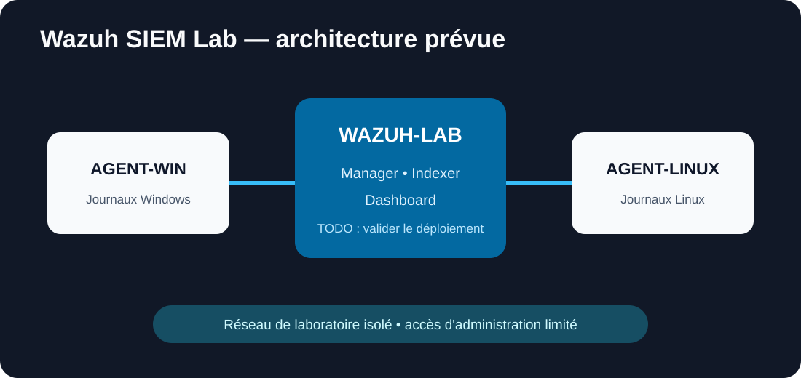

# Wazuh SIEM Lab

Documentation préparatoire d'un laboratoire Wazuh destiné à comprendre la collecte centralisée, la normalisation des événements et la validation de scénarios de détection. **Le laboratoire n'est pas présenté comme déployé ou validé.**

## Objectif

- définir une architecture Wazuh pédagogique ;
- inventorier les sources de journaux utiles ;
- préparer l'installation du serveur et des agents ;
- concevoir des événements de test défensifs ;
- documenter une méthode de recette et de conservation des preuves.

## Architecture

Architecture envisagée : un serveur Wazuh, un poste Windows, un serveur Linux et un poste d'administration, tous placés dans un réseau de laboratoire isolé.

`TODO: confirmer l'architecture après réalisation du lab.`

## Environnement technique

- solution prévue : Wazuh ;
- serveur prévu : Linux ;
- agents envisagés : Windows et Linux ;
- virtualisation et versions : `TODO: à compléter après réalisation du lab.`

## Prérequis

- ressources compatibles avec la version de Wazuh retenue ;
- horloge synchronisée sur toutes les VM ;
- résolution DNS ou noms statiques cohérents ;
- certificats et secrets conservés hors Git ;
- réseau de laboratoire autorisé et isolé ;
- snapshots avant changement important.

## Mise en place

La procédure sera renseignée uniquement après exécution réelle : préparation du serveur, installation des composants Wazuh, enrôlement de chaque agent, contrôle de la communication et durcissement des accès.

`TODO: à compléter après réalisation du lab.`

## Tests réalisés

Aucun test technique n'est revendiqué à ce stade.

| Scénario prévu | Attendu | État |
|---|---|---|
| échec d'authentification Windows | événement visible et horodaté | non exécuté |
| ajout contrôlé à un groupe local de test | changement remonté | non exécuté |
| arrêt d'un service de laboratoire | événement détecté | non exécuté |
| modification d'un fichier surveillé | alerte d'intégrité | non exécuté |
| événement Linux sudo de test | journal corrélé à l'hôte | non exécuté |

## Sécurité mise en œuvre

Mesures prévues : accès d'administration limité, secrets hors dépôt, segmentation, synchronisation horaire, chiffrement des échanges selon la documentation officielle et rétention adaptée.

`TODO: distinguer après réalisation les mesures prévues des mesures effectivement validées.`

## Résultats

`TODO: à compléter après réalisation du lab. Aucune capture ni métrique fictive ne sera ajoutée.`

## Compétences développées

Préparation d'architecture SIEM, identification des sources, gestion d'agents, lecture d'alertes, triage initial, documentation et recette.

## Captures d'écran

Le dossier `evidence/` recevra uniquement des captures réelles, datées et anonymisées.

`TODO: ajouter les captures après réalisation du lab.`

## Difficultés rencontrées

`TODO: renseigner les problèmes réellement observés : ressources, certificats, ports, enrôlement, parsing ou synchronisation.`

## Axes d'amélioration

- ajouter une source réseau après validation des agents ;
- formaliser les règles de triage ;
- tester la rétention et la sauvegarde ;
- comparer l'événement brut, la règle déclenchée et l'alerte finale ;
- documenter les faux positifs réellement rencontrés.

